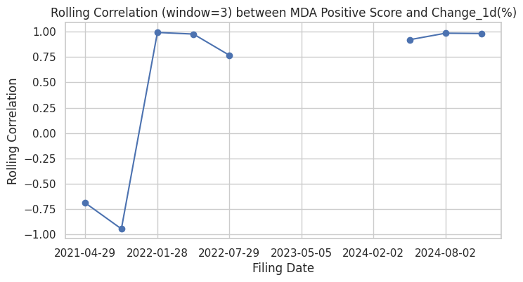
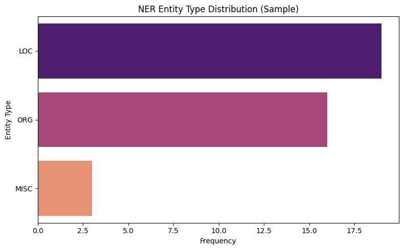
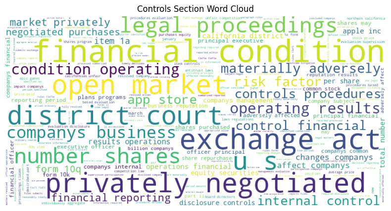
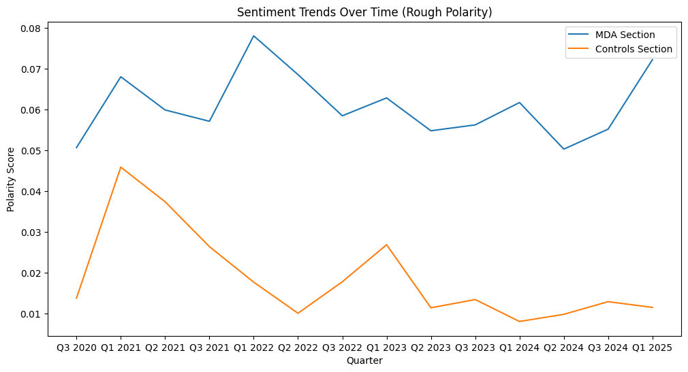

# NLP-Pipeline-for-Financial-Report-Analysis
End-to-end NLP analysis on Apple's SEC EDGAR financial reports, including summarization (BART), sentiment analysis (FinBERT), keyphrase extraction (KeyBERT), named entity recognition (fine-tuned BERT), and correlation with stock movements.

## 🔍 Features

- ⬇️ **Data Collection**: Downloaded quarterly 10-Q reports from SEC EDGAR
- 🧹 **Preprocessing**: Cleaned and extracted relevant sections for analysis
- 🧠 **NLP Tasks**:
  - **Summarization**: BART CNN model for concise report summaries
  - **Sentiment Analysis**: FinBERT applied to extracted sections
  - **Keyphrase Extraction**: Used KeyBERT to extract representative phrases
  - **Named Entity Recognition**: BERT model fine-tuned on CoNLL-2003
- 📈 **Stock Correlation**: Analyzed whether sentiment scores had a measurable impact on short-term stock movement

## 🛠 Tech Stack

- Python, Pandas, BeautifulSoup
- Transformers (HuggingFace)
- BART, FinBERT, KeyBERT
- scikit-learn, Matplotlib

## 📉 Result

> No statistically significant correlation was found between report sentiment and immediate stock price change, suggesting market reaction is influenced by a broader set of factors.

